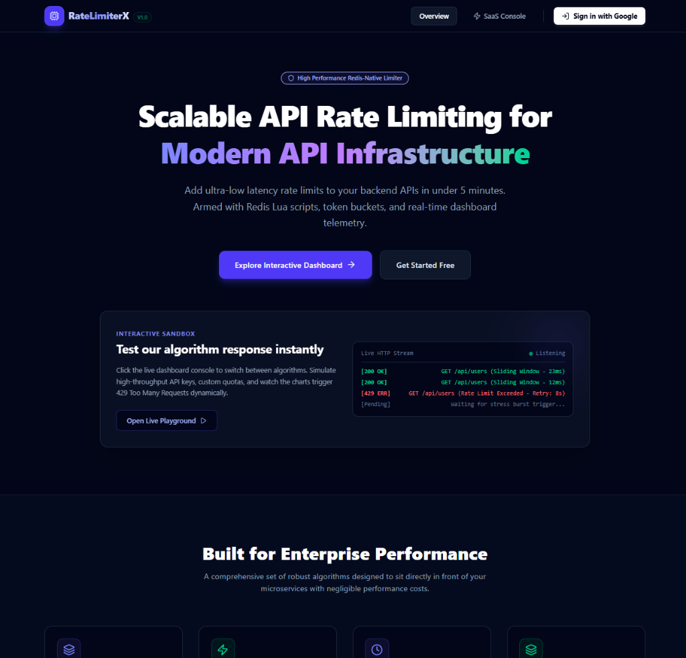
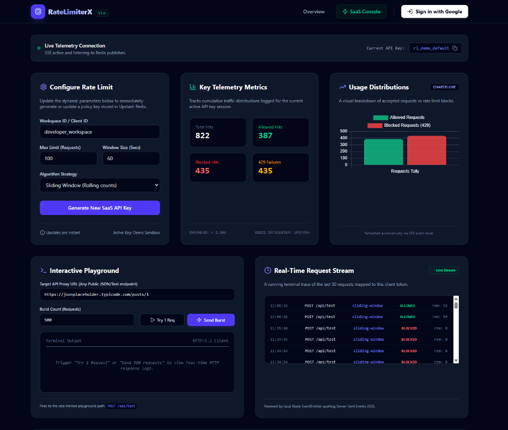

# RateLimiterX 🛡️

### **Distributed, Redis-Native API Rate Limiting Service & Developer Portal**

RateLimiterX is a production-grade, high-performance API rate limiter designed to sit directly in front of microservices and external APIs (like OpenWeather/Meteo) to protect them from overload, brute-force attacks, and API key billing spikes. 

It features an interactive **Developer SaaS Dashboard** built with React & Tailwind CSS, backed by a **Node.js Express** gateway server and a centralized **Upstash Redis** database.

---

## 📸 Project Showcases

### 🌐 Elegant SaaS Landing Page


### 📊 Real-Time Interactive Console & Telemetry


---

## ⚡ Core Features

* **4 Advanced Rate Limiting Algorithms**:
  * **Fixed Window**: Quick, basic limits resetting at clock boundaries.
  * **Sliding Window (Rolling Counts)**: Rolling calculation between the current and previous window to block boundary spikes.
  * **Token Bucket (Atomic refilling)**: Handles instant traffic bursts while continuously refilling tokens.
  * **Leaky Bucket (Traffic Shaping)**: Smooths traffic flow out at a constant processing rate.
* **Interactive API Playground**: Let users configure custom limits, generate secure API keys (`rl_live_...`), and test endpoints via a live console.
* **Stress Testing Generator**: Fire concurrent bursts of requests (e.g. 50, 100, 500) to see the rate limiter throttle requests and update metrics dynamically.
* **Server-Sent Events (SSE)**: Real-time, scrolling live terminal traces of request logs and allowed vs. blocked stats without polling.
* **Reverse Proxy Gateway**: Intercepts requests and dynamically proxies them to real external APIs (like weather engines) when limits are respected, shielding keys.
* **Firebase OAuth (Google Login)**: Secure login system with persistent, scoped API key tables and revocation management per user ID.

---

## 💡 System Design Highlights (For Interviewers 🎓)

If you are reviewing this project for a **Software Engineering Placement / SDE Role**, here are the critical engineering decisions made:

### 1. Atomic Lua Scripting (Prevents Race Conditions)
In distributed environments, standard "Read-then-Write" operations on Redis can lead to **race conditions** (multiple servers writing at the same millisecond). 
* **Solution**: The **Token Bucket** and **Leaky Bucket** algorithms are written as **atomic Redis Lua Scripts**. They execute directly inside the Redis memory process as a single transactional block, guaranteeing absolute consistency at any scale.

### 2. Multi-Tier Telemetry Pipeline
* Logging every request to a database can cause performance bottlenecks.
* **Solution**: RateLimiterX writes logs asynchronously to a capped Redis List (`logs:<apiKey>`) and increments stats using optimized Redis Hashing (`analytics:<apiKey>`). A Node.js `EventEmitter` couples the gateway thread to a **Server-Sent Events (SSE)** pipe, allowing the frontend charts to update instantly with sub-millisecond overhead.

### 3. Serverless Compatibility
* The Express server uses a decoupled, serverless-friendly wrapper. When deployed to Vercel, it is automatically converted into a single AWS Lambda function, scale-to-zero when idle, and communicating efficiently with serverless Upstash Redis.

---

## 🛠️ Tech Stack & Infrastructure

* **Frontend**: React.js, Tailwind CSS, Chart.js, Lucide Icons, Firebase client SDK
* **Backend**: Node.js, Express, Firebase Admin SDK
* **Database / Cache**: Upstash Redis (Serverless Cloud Redis)
* **DevOps**: Docker, Docker Compose, Vercel Serverless (CI/CD)

---

## 🚀 Quick Start (Local Setup)

### 1. Clone & Configure
```bash
git clone https://github.com/tejassalunkhe2806/RATE-LIMITER.git
cd RATE-LIMITER
```

Create a `.env` file in the root directory:
```env
UPSTASH_REDIS_REST_URL=your_upstash_redis_url
UPSTASH_REDIS_REST_TOKEN=your_upstash_redis_token
```

Configure your Firebase client keys in:
📂 `frontend/src/firebase.js`

### 2. Option A: Run locally using Node
```bash
# Install backend packages
npm install

# Build frontend assets
npm run build

# Start production server
npm start
```
Visit the server locally at `http://localhost:7860`.

### 3. Option B: Run containerized using Docker
```bash
docker-compose up --build
```
This starts both the Node application and a local Redis container automatically!
